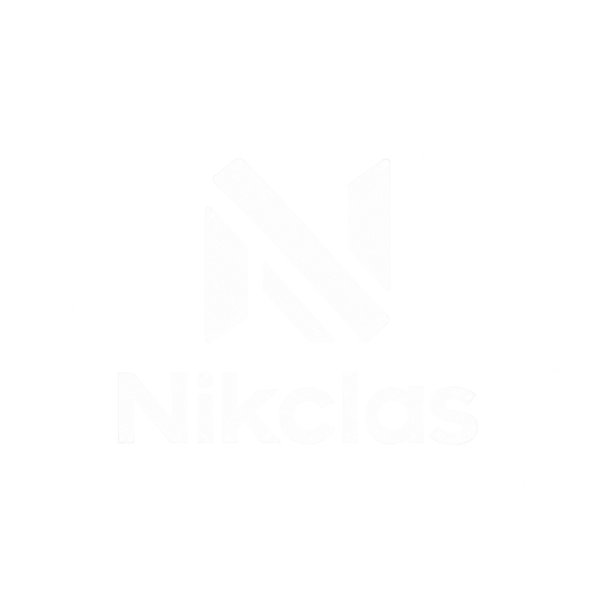

# Nikclas

[](../LICENSE)
[](https://react.dev/)
[](https://vite.dev/)
[](https://tailwindcss.com/)
[](https://www.typescriptlang.org/)
[](https://api.litellm.ai/)



**别再为 token 多花钱。** Nikclas 按每百万 token 价格（$/1M）对比前沿 AI
模型，用更少的钱交付同样的质量。

阅读其他语言版本：[English](../README.md) | [Espanol](README.es.md) |
[Francais](README.fr.md) | [Deutsch](README.de.md)

## 目录

- [1. 概述](#1-概述)
- [2. 功能](#2-功能)
- [3. 技术栈](#3-技术栈)
- [4. 项目结构](#4-项目结构)
- [5. 快速开始](#5-快速开始)
- [6. 价格数据](#6-价格数据)
- [7. 可用脚本](#7-可用脚本)
- [8. 许可证](#8-许可证)

## 1. 概述

Nikclas 是一个单页 React 应用，只回答一个问题：哪个 AI 模型能以最低
成本完成同样的工作？

首页是主题式 hero 区（按输入 $/1M 排序的实时价格面板），下方是双模
型对比器：在两侧分别选择供应商和模型，查看价格差距，并得到每 1M 输
入 token 可节省金额的明确结论。

所有价格均从
[LiteLLM 模型目录 API](https://api.litellm.ai/) 实时加载。

## 2. 功能

- **实时价格面板** — 流量最高的 4 个旗舰模型（`gpt-4o-mini`、
  `gpt-4o`、`claude-sonnet-4-6`、`deepseek-chat`），按输入 $/1M 排序，
  对数刻度条形图，`BEST` / `AVOID` 标签，以及实时 / 同步中 / 缓存状
  态指示。
- **双模型对比器** — 两侧均可选择供应商和模型，支持交换按钮，每个模
  型的数据卡片（输入、输出、上下文、速度、开发者能力），官方供应商链
  接，中央节省金额显示，以及通俗易懂的结论。
- **月度费用计算器** — 输入每月输入/输出 M token 数（或选预设），查看
  每个模型的月账单和日均费用及完整排名，最便宜的排在最前。
- **实时价格与诚实降级** — 价格请求
  `https://api.litellm.ai/model_catalog/{model_id}`，在 `localStorage`
  中缓存 24 小时，离线时使用内置快照（2026-09-22 已验证）。界面始终
  标明当前显示的数据来源。
- **科技风视觉** — 展示字体 Chakra Petch、正文字体 Inter、数据字体
  JetBrains Mono；深海军蓝蓝图主题，信号青（算力）与琥珀色（节省）
  点缀。
- **默认无障碍** — 语义化地标、带标签的表单控件、可见的键盘焦点、
  价格实时播报区域，并支持 `prefers-reduced-motion`。

## 3. 技术栈

| 分层 | 技术 |
| ---- | ---- |
| 界面 | React 19 + TypeScript |
| 构建 | Vite 8 |
| 样式 | Tailwind CSS 4 |
| 字体 | Chakra Petch、Inter、JetBrains Mono（Google Fonts）|
| 数据 | LiteLLM 模型目录 API（`api.litellm.ai`）|
| 检查 | ESLint + typescript-eslint |

无需后端。本应用是静态构建，直接在浏览器中调用公开定价 API。

## 4. 项目结构

```text
.
├── components/
│   ├── hero/
│   │   ├── HeroSection.tsx    # 主张、按钮、统计 + 布局
│   │   └── PriceBoard.tsx     # 实时价格面板
│   └── compare/
│       ├── CompareSection.tsx # 状态、节省计算、结论
│       ├── CompareForm.tsx    # 供应商 + 模型选择、交换
│       └── ModelCard.tsx      # 模型数据卡片
├── src/
│   ├── lib/
│   │   ├── litellm.ts         # 目录、API 客户端、缓存、hook
│   │   └── format.ts          # 格式化、厂商标签、条形刻度
│   ├── App.tsx                # 组装 HeroSection + CompareSection
│   ├── main.tsx               # React 入口
│   └── index.css              # Tailwind 主题、字体、动画
├── docs/
│   ├── README.es.md           # 西班牙语版
│   ├── README.fr.md           # 法语版
│   ├── README.de.md           # 德语版
│   └── README.zh.md           # 中文版
├── public/                    # 静态资源（横幅、图标、favicon）
├── index.html                 # 字体、meta、标题
└── LICENSE                    # GNU 通用公共许可证 v3.0
```

## 5. 快速开始

### 前置要求

- Node.js 20+ 和 npm。

### 安装

```bash
bun install
```

### 开发服务器

```bash
bun run dev
```

在浏览器打开 http://localhost:5173/。

### 生产构建

```bash
bun run build
bun run preview
```

`bun run build` 会做类型检查（`tsc -b`）并把静态站点输出到 `dist/`，
可部署到任何静态托管。

## 6. 价格数据

### 来源

`GET https://api.litellm.ai/model_catalog/{model_id}` 返回按 token 计
费（`input_cost_per_token`、`output_cost_per_token`）。应用将其乘以
1,000,000 得到 $/1M 价格，并读取 `max_input_tokens` 作为上下文窗口。
每次加载都会从 LiteLLM 目录刷新元数据（请求去重，然后缓存 24 小时）。

该 API 免费套餐为每个 IP 每天 100 次请求、无需密钥；完整加载 15 个模
型的目录需要 15 次请求。

### 已知限制：CORS

`api.litellm.ai` 不返回 `Access-Control-Allow-Origin` 头（已在带与不带
`Origin` 头的情况下验证；`OPTIONS` 返回 405），因此浏览器可能拦截实
时响应。此时应用会显示内置快照并标注为缓存。如果在自己的后端或代理
后部署（由其转发到 `api.litellm.ai`），即可恢复实时数据，无需改动任
何组件。

### 内置快照（2026-09-22 已验证，$/1M）

| 模型 | 供应商 | 输入 | 输出 | 上下文 |
| ---- | ------ | ---- | ---- | ------ |
| gpt-4o-mini | OpenAI | $0.15 | $0.60 | 128k |
| deepseek-chat | DeepSeek | $0.28 | $0.42 | 131k |
| deepseek-v4-flash | DeepSeek | $0.30 | $1.20 | 1M |
| deepinfra/nvidia/Llama-3.1-Nemotron-70B-Instruct | NVIDIA | $0.60 | $0.60 | 131k |
| gemini-2.5-flash-lite | Google | $0.10 | $0.40 | 1M |
| gpt-5.6-luna | OpenAI | $0.20 | $1.20 | 922k |
| zai/glm-5.3 | z.ai | $1.40 | $4.40 | 1M |
| qwencloud/qwen-max | Qwen | $1.60 | $6.40 | 31k |
| xai/grok-4.5 | xAI | $2.00 | $6.00 | 500k |
| gpt-4o | OpenAI | $2.50 | $10.00 | 128k |
| claude-sonnet-4-6 | Anthropic | $3.00 | $15.00 | 1M |
| moonshot/kimi-k3 | Kimi | $3.00 | $15.00 | 1M |
| claude-fable-5-1 | Anthropic | $10.00 | $50.00 | 1M |
| gpt-6-astra | OpenAI | $10.00 | $50.00 | 922k |
| claude-opus-5 | Anthropic | $5.00 | $25.00 | 1M |

卡片上的中位速度为静态参考值；价格与上下文为实时字段。

### 自动更新

没有数据库：`data/pricing.json` 是当前数据集，`git log -- data/pricing.json`
即价格历史。每 6 小时 `pricing-update` 工作流运行采集器并验证，有变
化就开 pull request（从不直写 `main`）；3 倍以上的跳变会标为
`[possible-anomaly]` 人工复核。贡献指南见
[CONTRIBUTING.md](../CONTRIBUTING.md)，包括如何新增供应商。

## 7. 可用脚本

| 命令 | 说明 |
| ---- | ---- |
| `bun run dev` | 启动 Vite 开发服务器 |
| `bun run build` | 类型检查并构建生产版本 |
| `bun run preview` | 本地预览生产构建 |
| `bun run lint` | 对项目运行 ESLint |

## 8. 许可证

本项目采用 **GNU 通用公共许可证 v3.0 或更高版本（GPLv3+）**。全文见
[LICENSE](../LICENSE)。

您可以自由运行、研究、分享和修改本软件，但任何分发作品都必须保持相
同许可且源码保持可获取。
